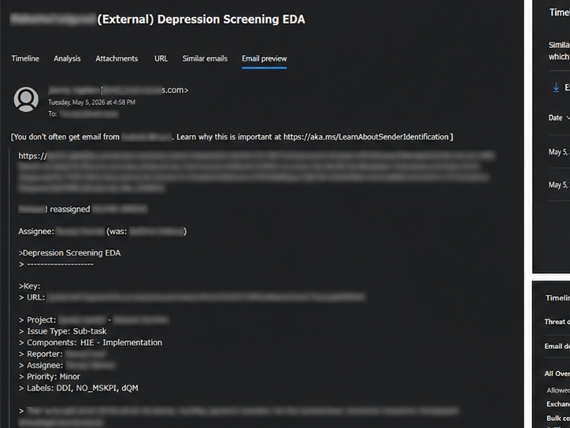
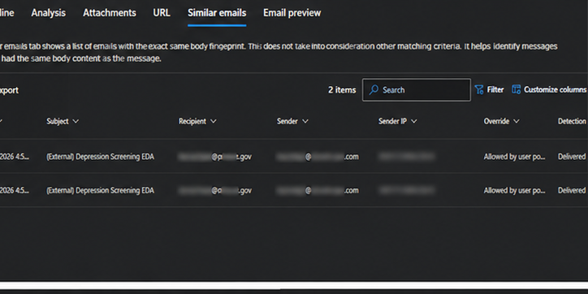
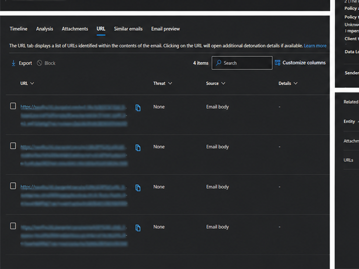
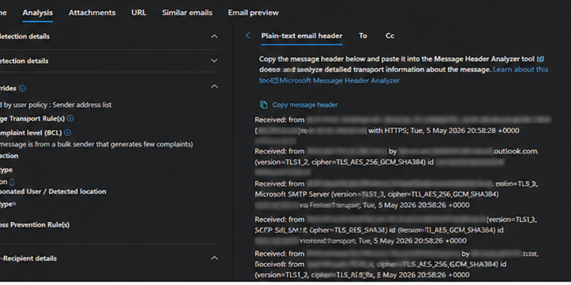
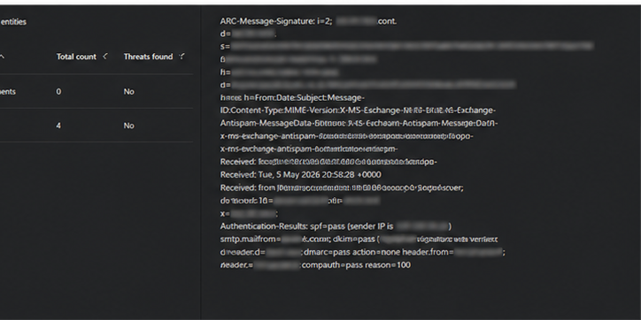

# Phishing Email Investigation & Containment

## Executive Summary

This project demonstrates a phishing email investigation conducted using enterprise SOC investigation methodologies. The investigation focused on identifying malicious indicators, validating user impact, analyzing endpoint activity, and implementing remediation actions.

---

## Tools Used

- Microsoft Defender XDR
- IBM QRadar
- CrowdStrike Falcon
- VirusTotal
- URLScan

---

## Investigation Objectives

- Analyze phishing indicators
- Identify potentially impacted users
- Validate endpoint activity
- Determine malicious vs benign behavior
- Contain and remediate threats
- Document findings using SOC workflows

---

## Investigation Workflow

1. Reviewed phishing alert generated in Microsoft Defender
2. Extracted sender information and suspicious URLs
3. Performed IOC analysis and URL reputation checks
4. Investigated user mailbox activity
5. Reviewed endpoint telemetry using CrowdStrike Falcon
6. Validated whether malicious execution occurred
7. Implemented containment actions
8. Documented findings and remediation steps

---

## MITRE ATT&CK Mapping

| Technique | Description |
|---|---|
| T1566 | Phishing |
| T1204 | User Execution |
| T1071 | Application Layer Protocol |

---

## Project Structure

```text
screenshots/  -> Investigation screenshots
queries/      -> SIEM and KQL queries
iocs/         -> Indicators of compromise
report/       -> Final incident report
```

---

## Key Skills Demonstrated

- SIEM Investigation
- EDR Analysis
- Threat Hunting
- IOC Analysis
- Incident Response
- Security Documentation
- Email Security Investigation

---

## Investigation Screenshots

### Email Preview Analysis



### Similar Emails Investigation



### URL Analysis



### Header & Detection Review



### IOC & Related Entity Review


